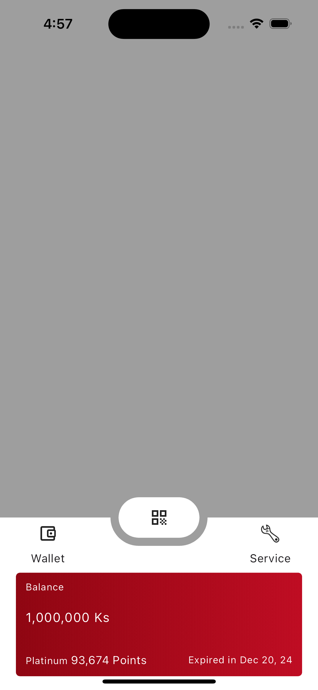
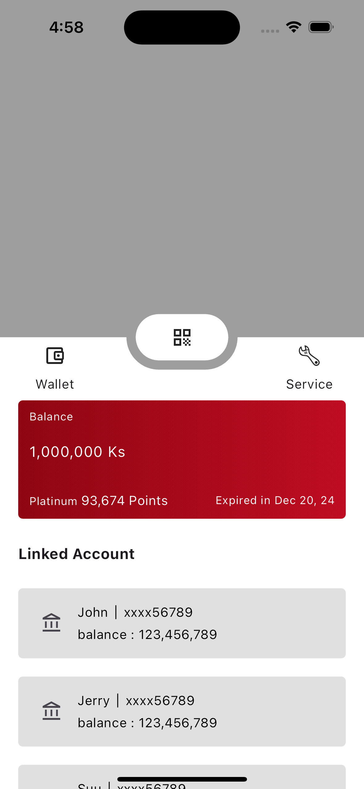
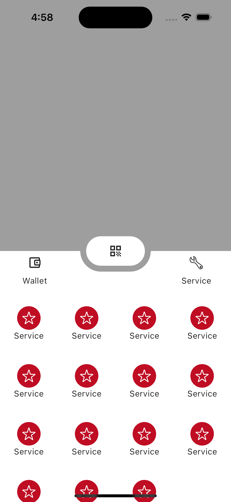
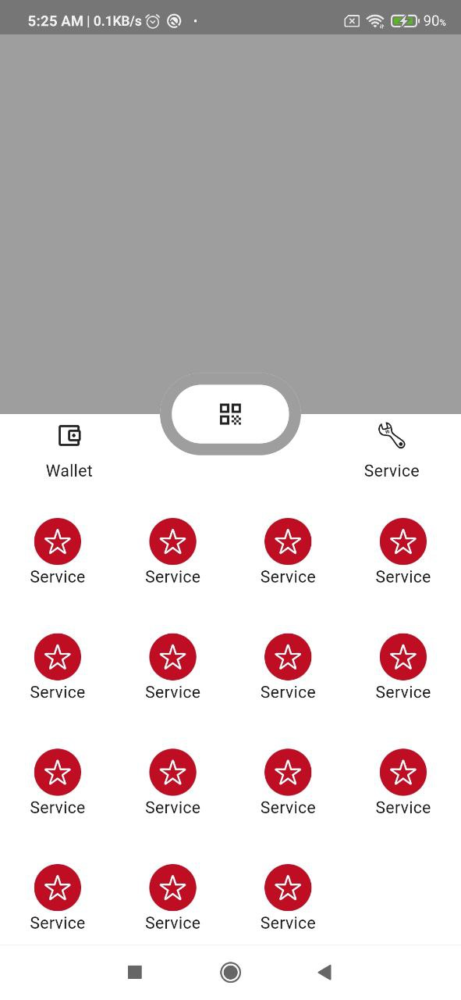

# Flutter Skill Test

This is the coding test assigned to Chit Ko


## Authors

- [@chitkoo](https://github.com/chitkoo)


## Running the project

To run this project, open your desired emulator/simulator.

```bash
  cd your/directory
  git clone project
```

```bash
  cd project/
  
  flutter pub get

  flutter run
```

For a better performance, run using this

```bash
  flutter run --profile
```

*Note that running profile mode is not supported for IOS simulator.

## Framework

[Flutter](https://linktodocumentation) (sdk: '>=3.2.6 <4.0.0')


*This project is written by only using Flutter framework.
## Screenshots

iPhone

<p float="left">



</p>

android

<p float="left">



</p>

